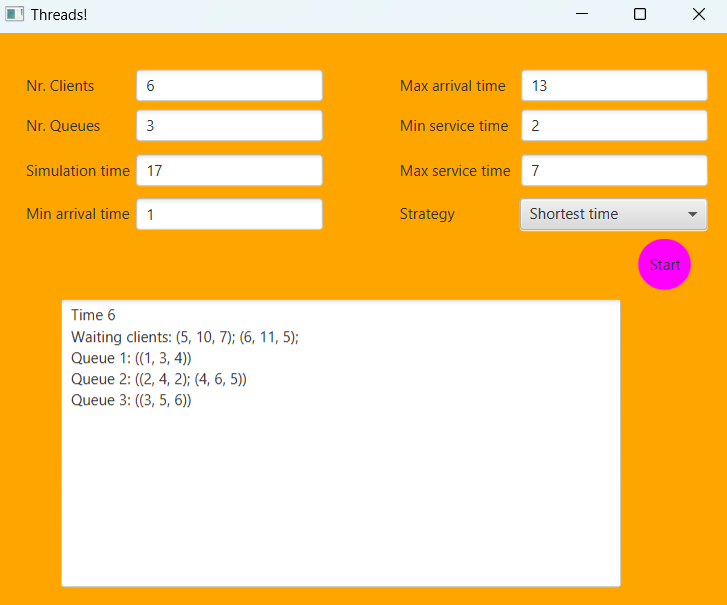

# Queue Management Simulation Application

## Problem Analysis
The project is an application for analyzing queuing-based systems. The application simulates a series of clients arriving for service, entering queues, waiting, being served, and leaving queues. It computes average waiting time, average service time, and peak hour.

### Functional Requirements
1. Allow users to set up the simulation.
2. Allow users to start the simulation.
3. Display real-time queues during simulation.
4. Provide statistics and metrics about the simulation, such as average waiting time and peak hour.

### Non-Functional Requirements
1. Ensure an intuitive and easy-to-use user interface.
2. Handle errors by providing informative error messages.
3. Ensure responsiveness and performance even with large numbers of clients and servers.

## Classes
### CLass diagram

### SimulationManager Class
- Manages clients, servers, and the overall simulation process.
- Important fields include N (number of clients), Q (number of servers), simulationTime, minArrivalTime, maxArrivalTime, minServiceTime, maxServiceTime, clients, servers, simulationEnd, serverResults, controller, strategy.
- Key methods include setQueueAllocationStrategy(), setInputParameters(), run(), generateClients(), distributeClients(), computeAvgWaitingTime(), computeAvgServiceTime(), computePeakTime(), updateUIAndWriteToLogFile().

### Server Class
- Represents a server entity that serves clients.
- Important fields include waiting (queue of clients waiting to be served), totalWaitingTime, serverId, serverWaitingTime, simulationManager.
- Key methods include call(), addClient().

### Client Class
- Represents a customer entity that arrives at the system to be served.
- Important fields include id, timeArrival, serviceTime.

### Strategy Pattern
- Implements dynamic selection between different strategies for allocating clients to queues.
- Defines a common interface for queue allocation strategies.
- Concrete strategies include ShortestTimeStrategy and ShortestQueueStrategy.

